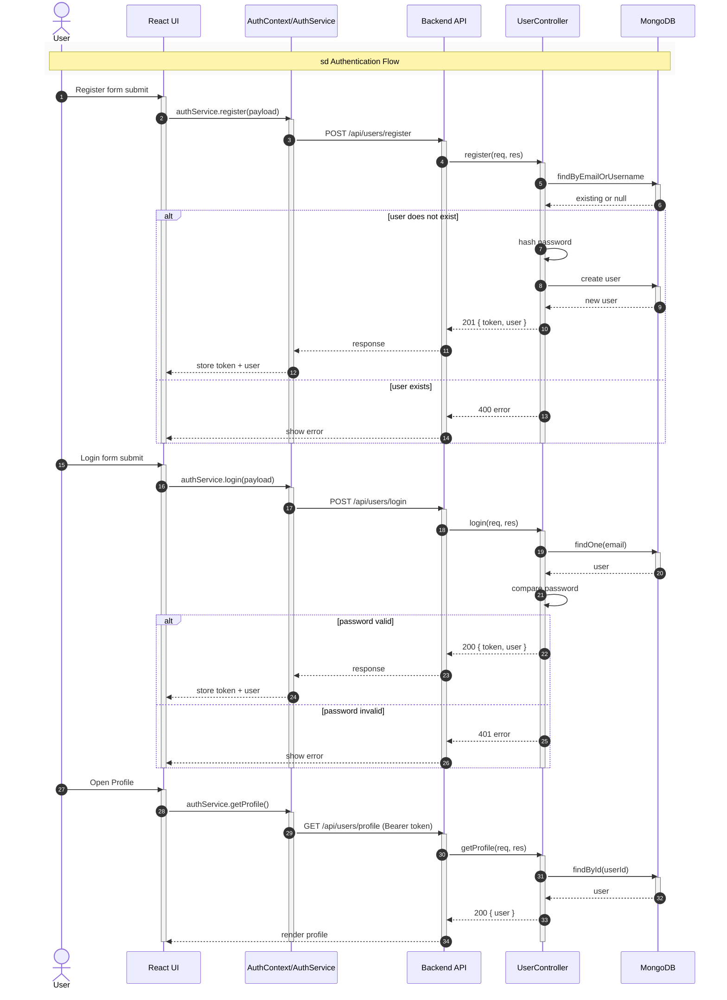
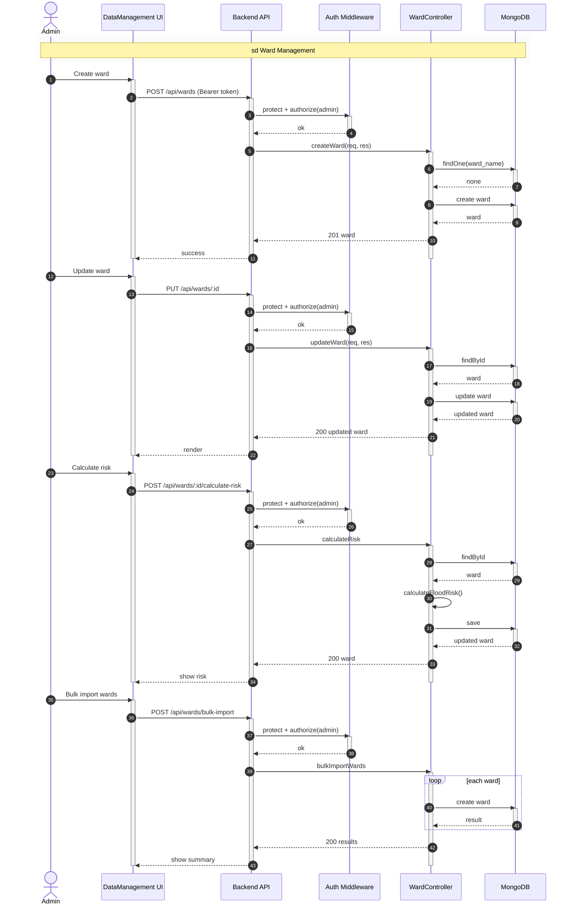
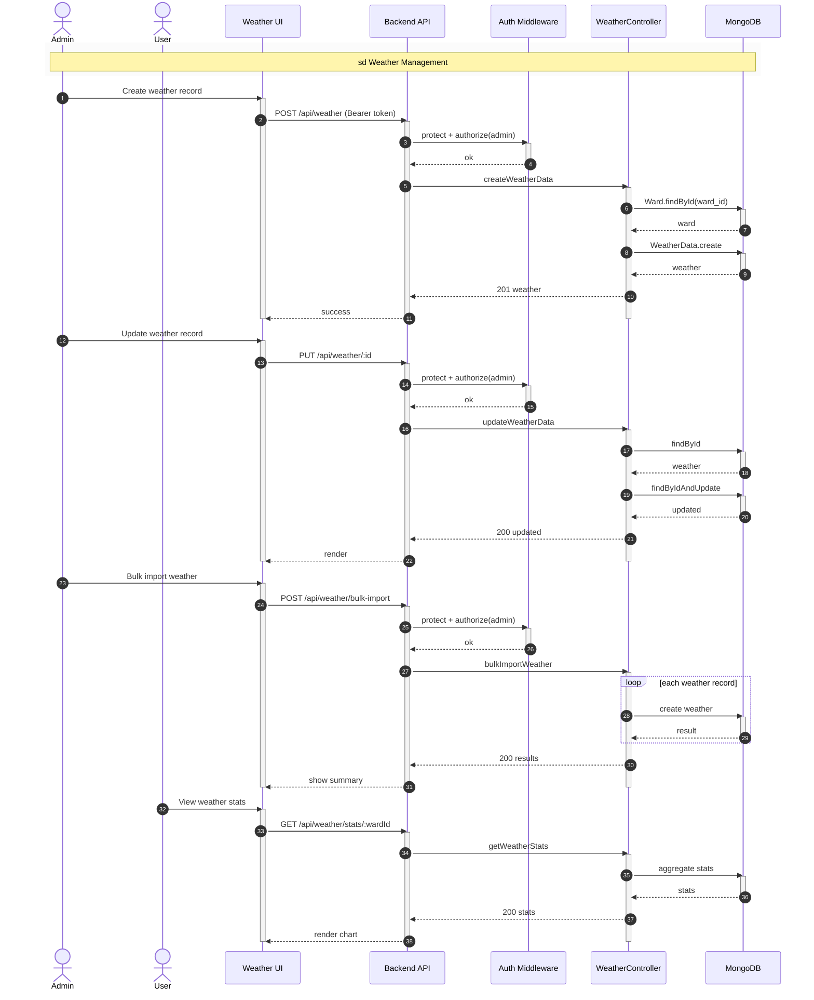
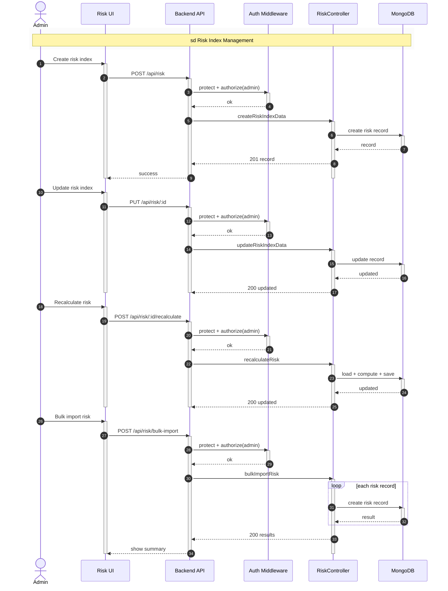
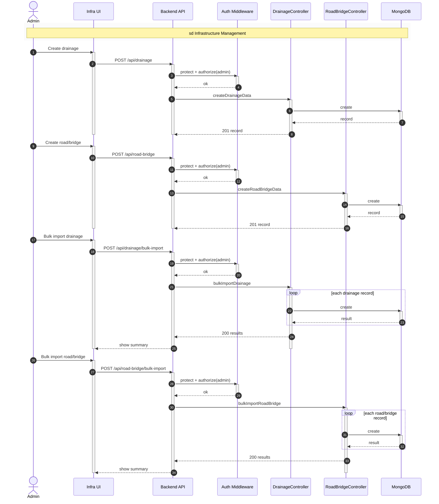

## Full System Sequence Diagrams

### 1. Authentication (Register + Login + Profile)

### 2. Ward Management (CRUD + Risk Calculation + Bulk Import)

### 3. Weather Management (CRUD + Stats + Bulk Import)

### 4. Risk Index Management (CRUD + Recalculate + Bulk Import)

### 5. Drainage & Road/Bridge Management (CRUD + Bulk Import)

