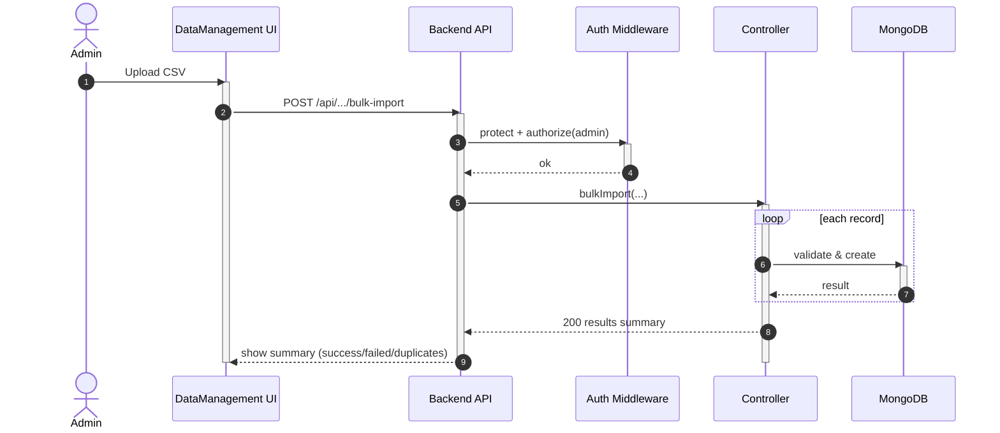

## UC - Import hàng loạt (Ward/Weather/Risk/Drainage/Road-Bridge)

### Mô tả luồng (dạng bảng)

**Bảng 2.71: Đặc tả Sequence Diagram – Import hàng loạt (Ward/Weather/Risk/Drainage/Road-Bridge)**

**Tác nhân/Thành phần**

| Thành phần | Mô tả |
|:-----------|:------|
| Admin | Quản trị hệ thống |
| DataManagement UI | Giao diện import CSV |
| Auth Middleware | Xác thực + phân quyền |
| Controller | Xử lý bulk import |
| Cơ sở dữ liệu | Lưu trữ dữ liệu |

**Điều kiện tiên quyết**

| Điều kiện | Mô tả |
|:----------|:------|
| Quyền truy cập | Admin đã đăng nhập và có quyền admin |

**Luồng chính**

| Bước | Mô tả |
|:-----|:------|
| 1 | Admin truy cập vào trang Data Management và chọn chức năng import CSV (Ward/Weather/Risk/Drainage/Road-Bridge). |
| 2 | Admin chọn file CSV từ máy tính và nhấn nút "Upload". |
| 3 | Giao diện đọc file CSV và gửi yêu cầu POST `/api/.../bulk-import` kèm dữ liệu CSV đến Backend API. |
| 4 | Backend API nhận yêu cầu và gọi Auth Middleware để xác thực token và kiểm tra quyền admin. |
| 5 | Auth Middleware xác nhận người dùng có quyền admin và cho phép tiếp tục. |
| 6 | Backend API chuyển yêu cầu đến Controller tương ứng (WardController/WeatherController/RiskController/DrainageController/RoadBridgeController) để xử lý. |
| 7 | Controller đọc từng dòng trong file CSV và thực hiện kiểm tra tính hợp lệ của dữ liệu (validate). |
| 8 | Controller lưu từng bản ghi hợp lệ vào cơ sở dữ liệu. |
| 9 | Cơ sở dữ liệu lưu thành công và trả về kết quả cho từng bản ghi. |
| 10 | Controller tổng hợp kết quả import (số bản ghi thành công, số bản ghi thất bại, số bản ghi trùng lặp) và trả về Backend API. |
| 11 | Backend API trả kết quả summary về giao diện DataManagement UI. |
| 12 | Giao diện hiển thị kết quả import (success/failed/duplicates) cho Admin. |

**Luồng sự kiện phụ**

**A1 – File không hợp lệ**

| Bước | Mô tả |
|:-----|:------|
| A1.1 | Controller phát hiện file CSV sai định dạng hoặc không đúng cấu trúc. |
| A1.2 | Controller trả về lỗi "Invalid CSV format". |
| A1.3 | Backend API chuyển lỗi về giao diện. |
| A1.4 | Giao diện hiển thị thông báo lỗi "File CSV không hợp lệ" cho Admin. |
