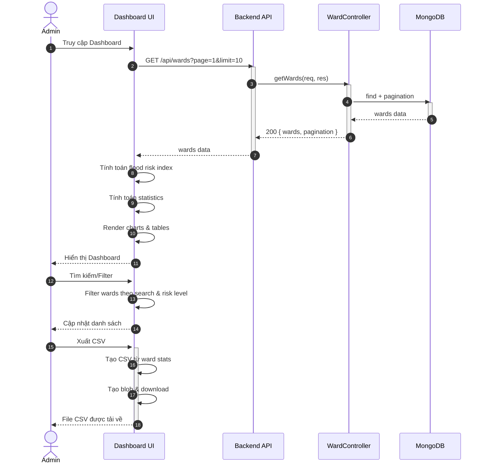

## UC - Xem Dashboard Quản Trị

### Mô tả luồng (dạng bảng)

**Bảng 2.77: Đặc tả Sequence Diagram – Xem Dashboard Quản Trị**

**Tác nhân/Thành phần**

| Thành phần | Mô tả |
|:-----------|:------|
| Admin | Quản trị hệ thống |
| Dashboard UI | Giao diện dashboard |
| Backend API | API backend |
| WardController | Xử lý dữ liệu phường/xã |
| Cơ sở dữ liệu | Lưu trữ dữ liệu |

**Điều kiện tiên quyết**

| Điều kiện | Mô tả |
|:----------|:------|
| Quyền truy cập | Admin đã đăng nhập và có quyền admin |

**Luồng chính**

| Bước | Mô tả |
|:-----|:------|
| 1 | Admin truy cập vào trang Dashboard Quản Trị. |
| 2 | Giao diện Dashboard tự động gửi yêu cầu GET `/api/wards?page=1&limit=10` đến Backend API để lấy danh sách phường/xã. |
| 3 | Backend API nhận yêu cầu và chuyển đến WardController để xử lý. |
| 4 | WardController thực hiện truy vấn cơ sở dữ liệu để lấy danh sách phường/xã với phân trang. |
| 5 | Cơ sở dữ liệu trả về danh sách phường/xã và thông tin phân trang. |
| 6 | WardController trả kết quả về Backend API. |
| 7 | Backend API trả kết quả về giao diện Dashboard. |
| 8 | Giao diện Dashboard nhận dữ liệu và thực hiện tính toán flood risk index cho từng phường/xã dựa trên các chỉ số (population_density, rainfall, low_elevation, urban_land, drainage_capacity). |
| 9 | Giao diện Dashboard tính toán các thống kê tổng hợp (tổng số phường, số phường rủi ro cao/trung bình/thấp, trung bình lượng mưa, trung bình độ cao, ...). |
| 10 | Giao diện Dashboard render các thành phần: Statistics Cards, Risk Distribution Chart, Key Metrics, Wards Table, Additional Statistics Grid. |
| 11 | Giao diện Dashboard hiển thị Dashboard đầy đủ cho Admin. |

**Luồng chính (Tìm kiếm/Filter)**

| Bước | Mô tả |
|:-----|:------|
| 1 | Admin nhập từ khóa tìm kiếm hoặc chọn mức độ rủi ro trong bộ lọc. |
| 2 | Giao diện Dashboard tự động filter danh sách phường/xã theo từ khóa tìm kiếm và mức độ rủi ro đã chọn (không cần gọi API lại). |
| 3 | Giao diện Dashboard cập nhật lại các thống kê và biểu đồ dựa trên dữ liệu đã filter. |
| 4 | Giao diện Dashboard hiển thị danh sách và thống kê đã được filter cho Admin. |

**Luồng chính (Xuất CSV)**

| Bước | Mô tả |
|:-----|:------|
| 1 | Admin nhấn nút "Xuất dữ liệu CSV" trên Dashboard. |
| 2 | Giao diện Dashboard tạo nội dung CSV từ dữ liệu ward stats hiện tại (bao gồm: Tên phường/xã, Chỉ số rủi ro, Mức độ, Mật độ dân số, Lượng mưa, Exposure, Susceptibility, Resilience). |
| 3 | Giao diện Dashboard tạo Blob object từ nội dung CSV. |
| 4 | Giao diện Dashboard tạo URL từ Blob và trigger download file CSV. |
| 5 | Browser tự động tải file CSV về máy tính của Admin với tên file `dashboard_export_YYYY-MM-DD.csv`. |
| 6 | Giao diện Dashboard hiển thị thông báo "Xuất dữ liệu thành công" cho Admin. |

**Luồng sự kiện phụ**

**A1 – Không có dữ liệu**

| Bước | Mô tả |
|:-----|:------|
| A1.1 | WardController truy vấn cơ sở dữ liệu nhưng không tìm thấy dữ liệu phường/xã nào. |
| A1.2 | Cơ sở dữ liệu trả về danh sách rỗng. |
| A1.3 | WardController trả về danh sách rỗng về Backend API. |
| A1.4 | Backend API chuyển kết quả về giao diện Dashboard. |
| A1.5 | Giao diện Dashboard hiển thị trạng thái trống hoặc thông báo "Chưa có dữ liệu" cho Admin. |
