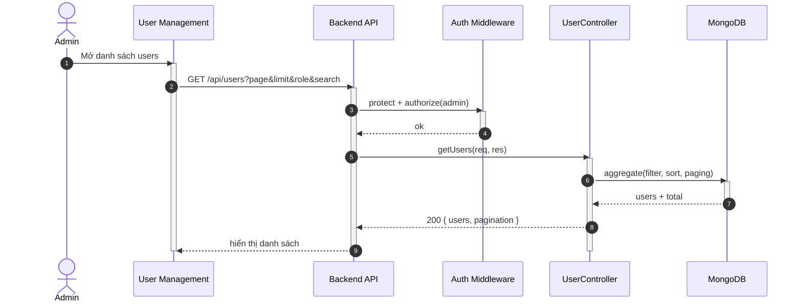

## UC - Admin xem danh sách người dùng

### Mô tả luồng (dạng bảng)

**Bảng 2.67: Đặc tả Sequence Diagram – Admin xem danh sách người dùng**

**Tác nhân/Thành phần**

| Thành phần | Mô tả |
|:-----------|:------|
| Admin | Quản trị hệ thống |
| User Management | Giao diện quản lý user |
| Auth Middleware | Xác thực + phân quyền |
| UserController | Lấy danh sách users |
| Cơ sở dữ liệu | Lưu trữ người dùng |

**Điều kiện tiên quyết**

| Điều kiện | Mô tả |
|:----------|:------|
| Quyền truy cập | Admin đã đăng nhập và có quyền admin |

**Luồng chính**

| Bước | Mô tả |
|:-----|:------|
| 1 | Admin truy cập vào trang User Management để xem danh sách người dùng. |
| 2 | Giao diện gửi yêu cầu GET `/api/users` kèm theo các tham số filter, sort, và pagination (page, limit, role, search). |
| 3 | Backend API nhận yêu cầu và gọi Auth Middleware để xác thực token và kiểm tra quyền admin. |
| 4 | Auth Middleware xác nhận người dùng có quyền admin và cho phép tiếp tục. |
| 5 | Backend API chuyển yêu cầu đến UserController để xử lý. |
| 6 | UserController thực hiện truy vấn cơ sở dữ liệu với các điều kiện filter, sort, và pagination. |
| 7 | Cơ sở dữ liệu trả về danh sách users và tổng số bản ghi. |
| 8 | UserController trả kết quả về Backend API, bao gồm danh sách users và thông tin phân trang. |
| 9 | Backend API trả kết quả về giao diện User Management. |
| 10 | Giao diện hiển thị danh sách users và phân trang cho Admin. |

**Luồng sự kiện phụ**

**A1 – Không đủ quyền**

| Bước | Mô tả |
|:-----|:------|
| A1.1 | Auth Middleware phát hiện người dùng không có quyền admin hoặc token không hợp lệ. |
| A1.2 | Auth Middleware trả về lỗi 403 Forbidden. |
| A1.3 | Backend API chuyển lỗi về giao diện. |
| A1.4 | Giao diện hiển thị thông báo lỗi "Không có quyền truy cập" cho Admin. |
