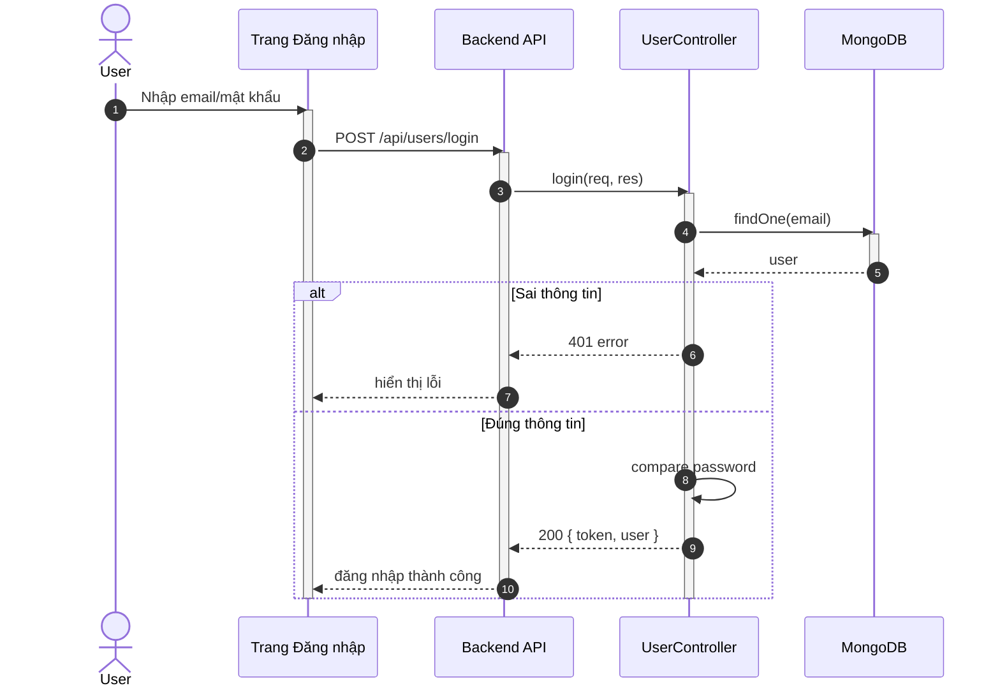

## UC - Đăng nhập

### Mô tả luồng (dạng bảng)

**Bảng 2.66: Đặc tả Sequence Diagram – Đăng nhập tài khoản**

**Tác nhân/Thành phần**

| Thành phần | Mô tả |
|:-----------|:------|
| Khách hàng | Người đăng nhập |
| Trang Đăng nhập | Giao diện đăng nhập |
| UserController | Xử lý đăng nhập |
| Cơ sở dữ liệu | Lưu trữ người dùng |

**Điều kiện tiên quyết**

| Điều kiện | Mô tả |
|:----------|:------|
| Truy cập | Khách hàng truy cập được vào Trang Đăng nhập |

**Luồng chính**

| Bước | Mô tả |
|:-----|:------|
| 1 | Khách hàng truy cập vào Trang Đăng nhập và nhập email và mật khẩu. |
| 2 | Khách hàng nhấn nút "Đăng nhập", và Trang Đăng nhập gửi yêu cầu đăng nhập đến UserController để xử lý. |
| 3 | UserController nhận yêu cầu và thực hiện tìm kiếm người dùng theo email trong cơ sở dữ liệu. |
| 4 | Cơ sở dữ liệu trả về thông tin người dùng (nếu tồn tại). |
| 5 | UserController kiểm tra mật khẩu bằng cách so sánh mật khẩu đã hash với mật khẩu người dùng nhập vào. |
| 6 | UserController xác nhận mật khẩu đúng và tạo token xác thực. |
| 7 | UserController trả kết quả đăng nhập thành công về Trang Đăng nhập, kèm theo token và thông tin người dùng. |
| 8 | Trang Đăng nhập hiển thị thông báo "Đăng nhập thành công" và lưu token vào localStorage. |

**Luồng sự kiện phụ**

**A1 – Sai thông tin**

| Bước | Mô tả |
|:-----|:------|
| A1.1 | UserController không tìm thấy user theo email hoặc mật khẩu không khớp. |
| A1.2 | UserController trả về lỗi "Sai email hoặc mật khẩu". |
| A1.3 | Trang Đăng nhập hiển thị thông báo lỗi cho khách hàng. |
