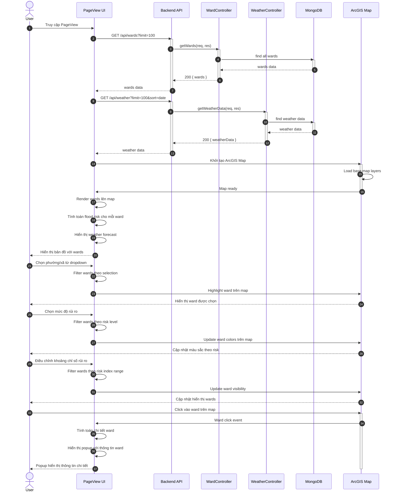

## UC - Xem Bản đồ và Phân tích Rủi ro (PageView)

### Mô tả luồng (dạng bảng)

**Bảng 2.78: Đặc tả Sequence Diagram – Xem Bản đồ và Phân tích Rủi ro (PageView)**

**Tác nhân/Thành phần**

| Thành phần | Mô tả |
|:-----------|:------|
| Người dùng | Xem bản đồ và phân tích rủi ro |
| PageView UI | Giao diện bản đồ |
| Backend API | API backend |
| WardController | Xử lý dữ liệu phường/xã |
| WeatherController | Xử lý dữ liệu thời tiết |
| ArcGIS Map | Bản đồ ArcGIS |
| Cơ sở dữ liệu | Lưu trữ dữ liệu |

**Điều kiện tiên quyết**

| Điều kiện | Mô tả |
|:----------|:------|
| Truy cập | Người dùng đã đăng nhập (nếu có yêu cầu) |

**Luồng chính (Khởi tạo PageView)**

| Bước | Mô tả |
|:-----|:------|
| 1 | Người dùng truy cập vào trang PageView (Bản đồ khu vực TP.HCM). |
| 2 | Giao diện PageView tự động gửi yêu cầu GET `/api/wards?limit=100` đến Backend API để lấy danh sách tất cả phường/xã. |
| 3 | Backend API nhận yêu cầu và chuyển đến WardController để xử lý. |
| 4 | WardController thực hiện truy vấn cơ sở dữ liệu để lấy danh sách phường/xã (tối đa 100 bản ghi). |
| 5 | Cơ sở dữ liệu trả về danh sách phường/xã. |
| 6 | WardController trả kết quả về Backend API. |
| 7 | Backend API trả kết quả về giao diện PageView. |
| 8 | Giao diện PageView gửi yêu cầu GET `/api/weather?limit=100&sort=date&order=asc` đến Backend API để lấy dữ liệu thời tiết. |
| 9 | Backend API nhận yêu cầu và chuyển đến WeatherController để xử lý. |
| 10 | WeatherController thực hiện truy vấn cơ sở dữ liệu để lấy dữ liệu thời tiết. |
| 11 | Cơ sở dữ liệu trả về dữ liệu thời tiết. |
| 12 | WeatherController trả kết quả về Backend API. |
| 13 | Backend API trả kết quả về giao diện PageView. |
| 14 | Giao diện PageView khởi tạo ArcGIS Map với base map layers. |
| 15 | ArcGIS Map load base map layers và thông báo map ready. |
| 16 | Giao diện PageView render các phường/xã lên bản đồ dựa trên dữ liệu geometry. |
| 17 | Giao diện PageView tính toán flood risk index cho mỗi phường/xã và gán màu sắc tương ứng (đỏ = cao, cam = trung bình, xanh = thấp). |
| 18 | Giao diện PageView hiển thị weather forecast từ dữ liệu thời tiết đã lấy. |
| 19 | Giao diện PageView hiển thị bản đồ đầy đủ với các phường/xã và weather forecast cho người dùng. |

**Luồng chính (Filter theo Phường/Xã)**

| Bước | Mô tả |
|:-----|:------|
| 1 | Người dùng chọn một phường/xã từ dropdown trong Filter Section. |
| 2 | Giao diện PageView filter danh sách wards theo phường/xã đã chọn. |
| 3 | Giao diện PageView gửi yêu cầu highlight ward được chọn lên ArcGIS Map. |
| 4 | ArcGIS Map highlight ward được chọn (zoom vào ward, thay đổi màu border, ...). |
| 5 | ArcGIS Map hiển thị ward được chọn rõ ràng cho người dùng. |

**Luồng chính (Filter theo Mức độ Rủi ro)**

| Bước | Mô tả |
|:-----|:------|
| 1 | Người dùng chọn/bỏ chọn các mức độ rủi ro (Cao, Trung Bình, Thấp) trong Filter Section. |
| 2 | Giao diện PageView filter danh sách wards theo các mức độ rủi ro đã chọn. |
| 3 | Giao diện PageView gửi yêu cầu cập nhật màu sắc wards lên ArcGIS Map. |
| 4 | ArcGIS Map cập nhật màu sắc và visibility của các wards theo filter. |
| 5 | ArcGIS Map hiển thị chỉ các wards có mức độ rủi ro đã chọn cho người dùng. |

**Luồng chính (Filter theo Khoảng Chỉ số Rủi ro)**

| Bước | Mô tả |
|:-----|:------|
| 1 | Người dùng điều chỉnh slider hoặc nhập giá trị min/max cho khoảng chỉ số rủi ro trong Filter Section. |
| 2 | Giao diện PageView filter danh sách wards theo khoảng chỉ số rủi ro đã chọn. |
| 3 | Giao diện PageView gửi yêu cầu cập nhật visibility của wards lên ArcGIS Map. |
| 4 | ArcGIS Map cập nhật visibility của các wards (chỉ hiển thị wards có chỉ số rủi ro trong khoảng đã chọn). |
| 5 | ArcGIS Map hiển thị chỉ các wards phù hợp với filter cho người dùng. |

**Luồng chính (Click vào Ward trên Map)**

| Bước | Mô tả |
|:-----|:------|
| 1 | Người dùng click vào một ward trên bản đồ ArcGIS Map. |
| 2 | ArcGIS Map phát hiện sự kiện click và gửi thông tin ward được click đến giao diện PageView. |
| 3 | Giao diện PageView nhận thông tin ward và tính toán các chỉ số chi tiết (flood_risk, risk_level, population_density, rainfall, low_elevation, urban_land, drainage_capacity, exposure, susceptibility, resilience). |
| 4 | Giao diện PageView hiển thị popup hoặc modal với thông tin chi tiết của ward. |
| 5 | Giao diện PageView hiển thị popup với thông tin chi tiết cho người dùng. |

**Luồng sự kiện phụ**

**A1 – Không tải được dữ liệu Wards**

| Bước | Mô tả |
|:-----|:------|
| A1.1 | WardController truy vấn cơ sở dữ liệu nhưng gặp lỗi hoặc không tìm thấy dữ liệu. |
| A1.2 | WardController trả về lỗi về Backend API. |
| A1.3 | Backend API chuyển lỗi về giao diện PageView. |
| A1.4 | Giao diện PageView hiển thị thông báo lỗi "Không thể tải dữ liệu khu vực" và yêu cầu người dùng thử lại sau. |

**A2 – Không tải được dữ liệu Weather**

| Bước | Mô tả |
|:-----|:------|
| A2.1 | WeatherController truy vấn cơ sở dữ liệu nhưng không tìm thấy dữ liệu thời tiết. |
| A2.2 | WeatherController trả về danh sách rỗng về Backend API. |
| A2.3 | Backend API chuyển kết quả về giao diện PageView. |
| A2.4 | Giao diện PageView hiển thị weather forecast section với trạng thái trống hoặc thông báo "Chưa có dữ liệu thời tiết". |
