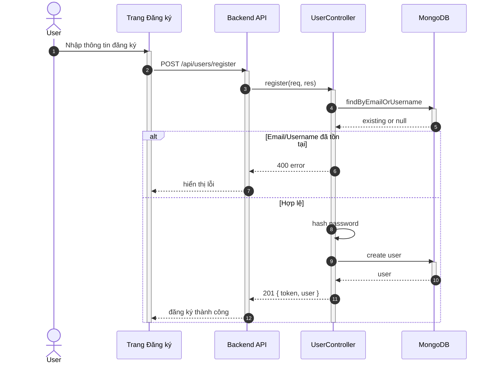

## UC - Đăng ký tài khoản

### Mô tả luồng (dạng bảng)

**Bảng 2.65: Đặc tả Sequence Diagram – Đăng ký tài khoản**

**Tác nhân/Thành phần**

| Thành phần | Mô tả |
|:-----------|:------|
| Khách hàng | Người đăng ký tài khoản |
| Trang Đăng ký | Giao diện nhập thông tin |
| UserController | Xử lý yêu cầu đăng ký |
| UserService | Kiểm tra email và tạo tài khoản |
| Cơ sở dữ liệu | Lưu trữ thông tin người dùng |

**Điều kiện tiên quyết**

| Điều kiện | Mô tả |
|:----------|:------|
| Truy cập | Khách hàng truy cập được vào Trang Đăng ký |

**Luồng chính**

| Bước | Mô tả |
|:-----|:------|
| 1 | Khách hàng truy cập vào Trang Đăng ký và nhập đầy đủ thông tin đăng ký, bao gồm: tên, email và mật khẩu. |
| 2 | Khách hàng nhấn nút "Đăng ký", và Trang Đăng ký gửi yêu cầu đăng ký đến UserController để xử lý. |
| 3 | UserController nhận yêu cầu và thực hiện bước kiểm tra tính hợp lệ của dữ liệu (valid email, độ dài mật khẩu, các trường phải đủ,…). |
| 4 | UserController xác nhận dữ liệu hợp lệ và yêu cầu UserService kiểm tra xem email đã tồn tại trong hệ thống hay chưa. |
| 5 | UserService truy vấn cơ sở dữ liệu để tìm email, sau đó nhận được phản hồi từ cơ sở dữ liệu rằng email chưa tồn tại. |
| 6 | UserService tiến hành tạo tài khoản mới bằng cách gửi yêu cầu lưu thông tin người dùng vào cơ sở dữ liệu. |
| 7 | Cơ sở dữ liệu lưu thành công thông tin tài khoản mới và trả kết quả cho UserService. |
| 8 | UserService thông báo lại cho UserController rằng tài khoản đã được tạo thành công. |
| 9 | UserController trả kết quả thành công về Trang Đăng ký, kèm theo thông báo "Đăng ký thành công". |
| 10 | Trang Đăng ký hiển thị thông báo "Đăng ký thành công" cho khách hàng. |

**Luồng sự kiện phụ**

**A1 – Thông tin không hợp lệ**

| Bước | Mô tả |
|:-----|:------|
| A1.1 | UserController kiểm tra tính hợp lệ của dữ liệu đầu vào. |
| A1.2 | UserController phát hiện lỗi (email không hợp lệ / mật khẩu quá ngắn / missing field…). |
| A1.3 | UserController trả về lỗi. |
| A1.4 | Trang đăng ký hiển thị: "Thông tin không hợp lệ". |

**A2 - Email đã tồn tại**

| Bước | Mô tả |
|:-----|:------|
| A2.1 | UserService kiểm tra email trong DB. |
| A2.2 | DB trả về kết quả email đã tồn tại. |
| A2.3 | UserService trả về lỗi "Email đã tồn tại". |
| A2.4 | UserController gửi lỗi về giao diện. |
| A2.5 | Trang Đăng ký hiển thị: "Email đã tồn tại". |
