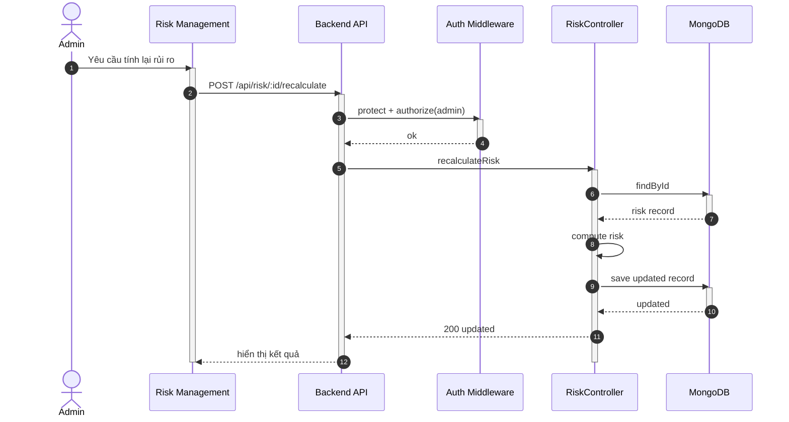

## UC - Tính toán lại Chỉ số Rủi ro

### Mô tả luồng (dạng bảng)

**Bảng 2.70: Đặc tả Sequence Diagram – Tính toán lại Chỉ số Rủi ro**

**Tác nhân/Thành phần**

| Thành phần | Mô tả |
|:-----------|:------|
| Admin | Quản trị hệ thống |
| Risk Management | Giao diện quản lý rủi ro |
| Auth Middleware | Xác thực + phân quyền |
| RiskController | Tính toán lại rủi ro |
| Cơ sở dữ liệu | Lưu trữ risk index |

**Điều kiện tiên quyết**

| Điều kiện | Mô tả |
|:----------|:------|
| Quyền truy cập | Admin đã đăng nhập và có quyền admin |

**Luồng chính**

| Bước | Mô tả |
|:-----|:------|
| 1 | Admin truy cập vào trang Risk Management và chọn bản ghi rủi ro cần tính toán lại. |
| 2 | Admin nhấn nút "Tính toán lại", và giao diện gửi yêu cầu POST `/api/risk/:id/recalculate` đến Backend API. |
| 3 | Backend API nhận yêu cầu và gọi Auth Middleware để xác thực token và kiểm tra quyền admin. |
| 4 | Auth Middleware xác nhận người dùng có quyền admin và cho phép tiếp tục. |
| 5 | Backend API chuyển yêu cầu đến RiskController để xử lý. |
| 6 | RiskController tìm bản ghi rủi ro theo ID trong cơ sở dữ liệu. |
| 7 | Cơ sở dữ liệu trả về thông tin bản ghi rủi ro. |
| 8 | RiskController thực hiện tính toán lại chỉ số rủi ro dựa trên các dữ liệu liên quan (weather, drainage, road/bridge, ward). |
| 9 | RiskController cập nhật bản ghi rủi ro với giá trị mới và lưu vào cơ sở dữ liệu. |
| 10 | Cơ sở dữ liệu lưu thành công và trả về bản ghi đã cập nhật. |
| 11 | RiskController trả kết quả cập nhật thành công về Backend API. |
| 12 | Backend API trả kết quả về giao diện Risk Management. |
| 13 | Giao diện hiển thị thông báo "Tính toán lại thành công" và cập nhật giá trị chỉ số rủi ro cho Admin. |

**Luồng sự kiện phụ**

**A1 – Không tìm thấy bản ghi**

| Bước | Mô tả |
|:-----|:------|
| A1.1 | RiskController truy vấn cơ sở dữ liệu để tìm bản ghi rủi ro theo ID. |
| A1.2 | Cơ sở dữ liệu trả về kết quả không tìm thấy bản ghi. |
| A1.3 | RiskController trả về lỗi 404 Not Found. |
| A1.4 | Backend API chuyển lỗi về giao diện. |
| A1.5 | Giao diện hiển thị thông báo lỗi "Không tìm thấy bản ghi" cho Admin. |
