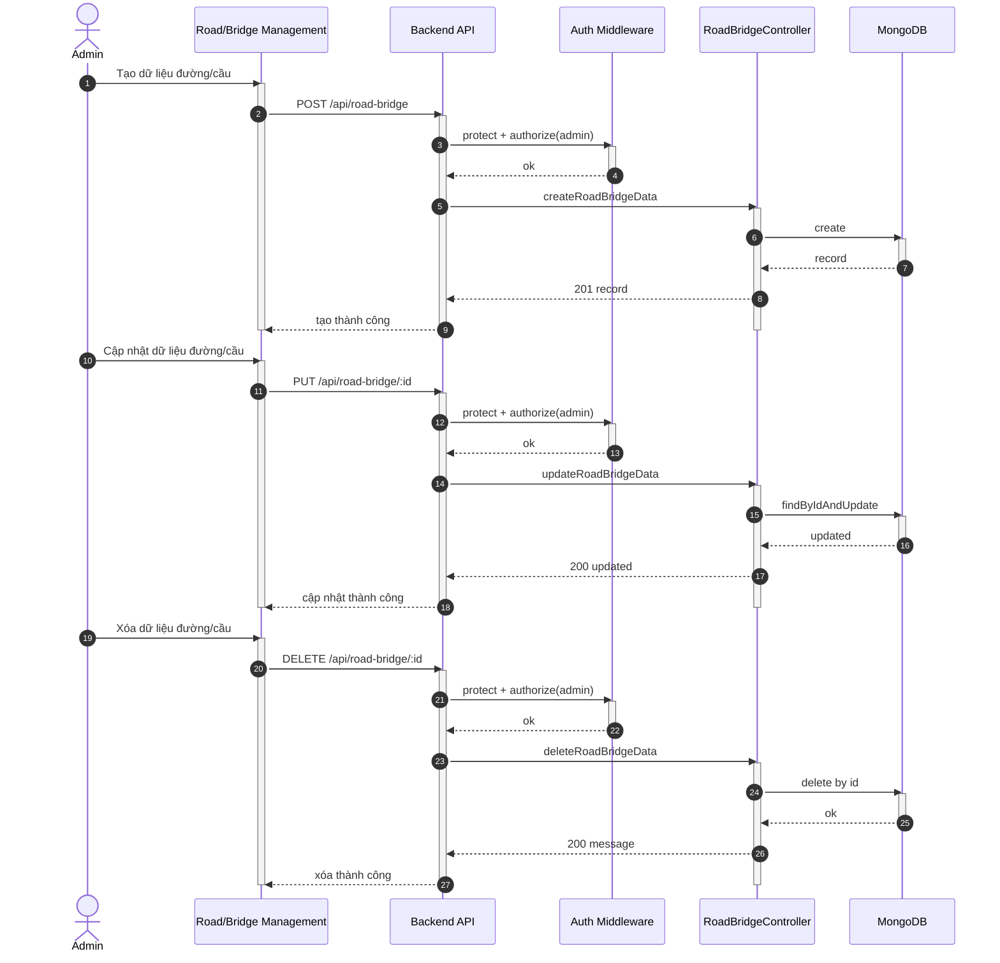

## UC - Quản lý Đường & Cầu (CRUD)

### Mô tả luồng (dạng bảng)

**Bảng 2.73: Đặc tả Sequence Diagram – Quản lý Đường & Cầu (CRUD)**

**Tác nhân/Thành phần**

| Thành phần | Mô tả |
|:-----------|:------|
| Admin | Quản trị hệ thống |
| Road/Bridge Management | Giao diện quản lý đường/cầu |
| Auth Middleware | Xác thực + phân quyền |
| RoadBridgeController | CRUD đường/cầu |
| Cơ sở dữ liệu | Lưu trữ dữ liệu |

**Điều kiện tiên quyết**

| Điều kiện | Mô tả |
|:----------|:------|
| Quyền truy cập | Admin đã đăng nhập và có quyền admin |

**Luồng chính (Create)**

| Bước | Mô tả |
|:-----|:------|
| 1 | Admin truy cập vào trang Road/Bridge Management và nhập thông tin dữ liệu đường/cầu mới. |
| 2 | Admin nhấn nút "Tạo mới", và giao diện gửi yêu cầu POST `/api/road-bridge` đến Backend API. |
| 3 | Backend API nhận yêu cầu và gọi Auth Middleware để xác thực token và kiểm tra quyền admin. |
| 4 | Auth Middleware xác nhận người dùng có quyền admin và cho phép tiếp tục. |
| 5 | Backend API chuyển yêu cầu đến RoadBridgeController để xử lý. |
| 6 | RoadBridgeController thực hiện kiểm tra tính hợp lệ của dữ liệu đầu vào. |
| 7 | RoadBridgeController tạo bản ghi dữ liệu đường/cầu mới và lưu vào cơ sở dữ liệu. |
| 8 | Cơ sở dữ liệu lưu thành công và trả về road/bridge data đã tạo. |
| 9 | RoadBridgeController trả kết quả tạo thành công về Backend API. |
| 10 | Backend API trả kết quả về giao diện Road/Bridge Management. |
| 11 | Giao diện hiển thị thông báo "Tạo thành công" cho Admin. |

**Luồng chính (Update)**

| Bước | Mô tả |
|:-----|:------|
| 1 | Admin chọn bản ghi dữ liệu đường/cầu cần cập nhật và chỉnh sửa thông tin. |
| 2 | Admin nhấn nút "Cập nhật", và giao diện gửi yêu cầu PUT `/api/road-bridge/:id` đến Backend API. |
| 3 | Backend API nhận yêu cầu và gọi Auth Middleware để xác thực và phân quyền. |
| 4 | RoadBridgeController tìm bản ghi theo ID và cập nhật thông tin trong cơ sở dữ liệu. |
| 5 | Cơ sở dữ liệu cập nhật thành công và trả về bản ghi đã cập nhật. |
| 6 | RoadBridgeController trả kết quả cập nhật thành công về giao diện. |
| 7 | Giao diện hiển thị thông báo "Cập nhật thành công" cho Admin. |

**Luồng chính (Delete)**

| Bước | Mô tả |
|:-----|:------|
| 1 | Admin chọn bản ghi dữ liệu đường/cầu cần xóa và nhấn nút "Xóa". |
| 2 | Giao diện gửi yêu cầu DELETE `/api/road-bridge/:id` đến Backend API. |
| 3 | Backend API nhận yêu cầu và gọi Auth Middleware để xác thực và phân quyền. |
| 4 | RoadBridgeController tìm bản ghi theo ID và xóa bản ghi trong cơ sở dữ liệu. |
| 5 | Cơ sở dữ liệu xóa thành công. |
| 6 | RoadBridgeController trả kết quả xóa thành công về giao diện. |
| 7 | Giao diện hiển thị thông báo "Xóa thành công" cho Admin. |

**Luồng sự kiện phụ**

**A1 – Không đủ quyền**

| Bước | Mô tả |
|:-----|:------|
| A1.1 | Auth Middleware phát hiện người dùng không có quyền admin hoặc token không hợp lệ. |
| A1.2 | Auth Middleware trả về lỗi 403 Forbidden. |
| A1.3 | Backend API chuyển lỗi về giao diện. |
| A1.4 | Giao diện hiển thị thông báo lỗi "Không có quyền truy cập" cho Admin. |
