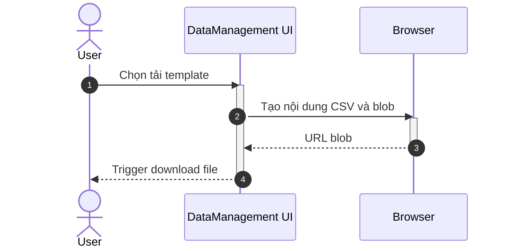

## UC - Tải template CSV

### Mô tả luồng (dạng bảng)

**Bảng 2.76: Đặc tả Sequence Diagram – Tải template CSV**

**Tác nhân/Thành phần**

| Thành phần | Mô tả |
|:-----------|:------|
| Người dùng | Tải file mẫu |
| DataManagement UI | Giao diện quản lý dữ liệu |
| Browser | Tạo blob và tải file |

**Điều kiện tiên quyết**

| Điều kiện | Mô tả |
|:----------|:------|
| Trình duyệt | Hỗ trợ download blob |

**Luồng chính**

| Bước | Mô tả |
|:-----|:------|
| 1 | Người dùng truy cập vào trang Data Management và chọn chức năng tải template CSV (Ward/Weather/Risk/Drainage/Road-Bridge). |
| 2 | Người dùng nhấn nút "Tải template", và giao diện nhận yêu cầu. |
| 3 | Giao diện tạo nội dung CSV từ dữ liệu mẫu (sample data) với các cột và dòng header tương ứng. |
| 4 | Giao diện chuyển nội dung CSV thành Blob object. |
| 5 | Browser tạo URL từ Blob object (blob URL). |
| 6 | Giao diện tạo một thẻ `<a>` ẩn với thuộc tính `href` trỏ đến blob URL và `download` với tên file template. |
| 7 | Giao diện trigger sự kiện click trên thẻ `<a>` để bắt đầu tải file. |
| 8 | Browser tự động tải file CSV về máy tính của người dùng. |
| 9 | Giao diện hiển thị thông báo "Tải template thành công" cho người dùng. |

**Luồng sự kiện phụ**

**A1 – Trình duyệt chặn tải**

| Bước | Mô tả |
|:-----|:------|
| A1.1 | Browser phát hiện cài đặt chặn tải file tự động hoặc popup blocker đang bật. |
| A1.2 | Browser chặn việc tải file và không thực hiện download. |
| A1.3 | Giao diện phát hiện file không được tải và hiển thị cảnh báo "Trình duyệt đã chặn tải file, vui lòng cho phép tải file trong cài đặt trình duyệt". |
