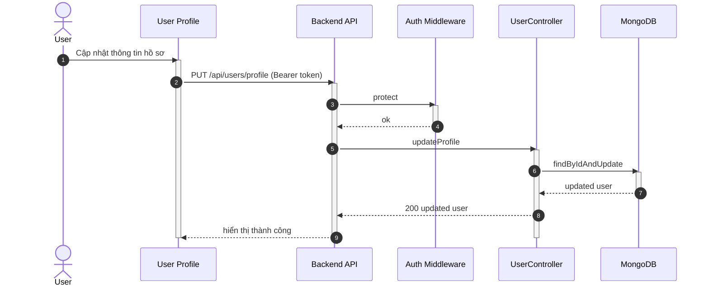

## UC - Cập nhật hồ sơ người dùng

### Mô tả luồng (dạng bảng)

**Bảng 2.75: Đặc tả Sequence Diagram – Cập nhật hồ sơ người dùng**

**Tác nhân/Thành phần**

| Thành phần | Mô tả |
|:-----------|:------|
| Người dùng | Cập nhật hồ sơ |
| User Profile | Giao diện hồ sơ |
| Auth Middleware | Xác thực |
| UserController | Cập nhật thông tin |
| Cơ sở dữ liệu | Lưu trữ người dùng |

**Điều kiện tiên quyết**

| Điều kiện | Mô tả |
|:----------|:------|
| Đăng nhập | Người dùng đã đăng nhập |

**Luồng chính**

| Bước | Mô tả |
|:-----|:------|
| 1 | Người dùng truy cập vào trang User Profile và chỉnh sửa thông tin hồ sơ (tên, email, số điện thoại, ...). |
| 2 | Người dùng nhấn nút "Cập nhật", và giao diện gửi yêu cầu PUT `/api/users/profile` kèm token xác thực đến Backend API. |
| 3 | Backend API nhận yêu cầu và gọi Auth Middleware để xác thực token. |
| 4 | Auth Middleware kiểm tra token và xác nhận người dùng đã đăng nhập, cho phép tiếp tục. |
| 5 | Backend API chuyển yêu cầu đến UserController để xử lý. |
| 6 | UserController thực hiện kiểm tra tính hợp lệ của dữ liệu đầu vào. |
| 7 | UserController tìm người dùng theo ID từ token và cập nhật thông tin trong cơ sở dữ liệu. |
| 8 | Cơ sở dữ liệu cập nhật thành công và trả về thông tin người dùng đã cập nhật. |
| 9 | UserController trả kết quả cập nhật thành công về Backend API. |
| 10 | Backend API trả kết quả về giao diện User Profile. |
| 11 | Giao diện hiển thị thông báo "Cập nhật thành công" và cập nhật thông tin hiển thị cho người dùng. |

**Luồng sự kiện phụ**

**A1 – Token không hợp lệ**

| Bước | Mô tả |
|:-----|:------|
| A1.1 | Auth Middleware phát hiện token sai, hết hạn, hoặc không tồn tại. |
| A1.2 | Auth Middleware trả về lỗi 401 Unauthorized. |
| A1.3 | Backend API chuyển lỗi về giao diện. |
| A1.4 | Giao diện hiển thị thông báo lỗi "Phiên đăng nhập đã hết hạn" và yêu cầu người dùng đăng nhập lại. |
