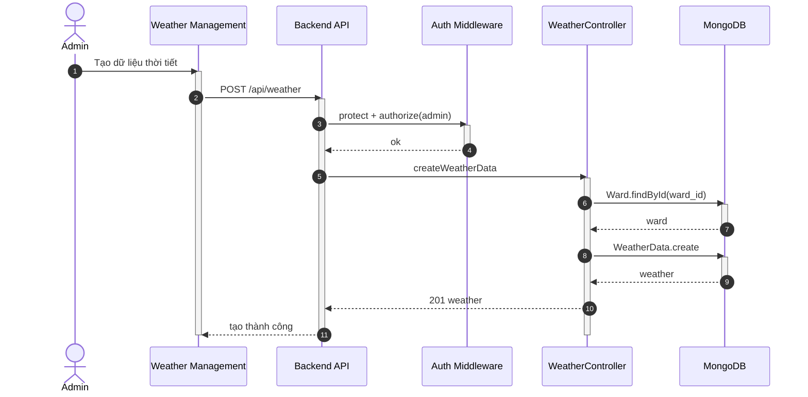

## UC - Tạo dữ liệu Thời tiết

### Mô tả luồng (dạng bảng)

**Bảng 2.69: Đặc tả Sequence Diagram – Tạo dữ liệu Thời tiết**

**Tác nhân/Thành phần**

| Thành phần | Mô tả |
|:-----------|:------|
| Admin | Quản trị hệ thống |
| Weather Management | Giao diện quản lý thời tiết |
| Auth Middleware | Xác thực + phân quyền |
| WeatherController | Tạo dữ liệu thời tiết |
| Cơ sở dữ liệu | Lưu trữ thời tiết |

**Điều kiện tiên quyết**

| Điều kiện | Mô tả |
|:----------|:------|
| Quyền truy cập | Admin đã đăng nhập và có quyền admin |

**Luồng chính**

| Bước | Mô tả |
|:-----|:------|
| 1 | Admin truy cập vào trang Weather Management và nhập đầy đủ thông tin dữ liệu thời tiết (ward_id, date, temperature, rainfall, humidity, wind_speed). |
| 2 | Admin nhấn nút "Tạo mới", và giao diện gửi yêu cầu POST `/api/weather` đến Backend API. |
| 3 | Backend API nhận yêu cầu và gọi Auth Middleware để xác thực token và kiểm tra quyền admin. |
| 4 | Auth Middleware xác nhận người dùng có quyền admin và cho phép tiếp tục. |
| 5 | Backend API chuyển yêu cầu đến WeatherController để xử lý. |
| 6 | WeatherController thực hiện kiểm tra tính hợp lệ của dữ liệu đầu vào. |
| 7 | WeatherController kiểm tra ward_id có tồn tại trong cơ sở dữ liệu bằng cách truy vấn Ward collection. |
| 8 | Cơ sở dữ liệu trả về thông tin ward (nếu tồn tại). |
| 9 | WeatherController tạo dữ liệu thời tiết mới và lưu vào cơ sở dữ liệu. |
| 10 | Cơ sở dữ liệu lưu thành công và trả về weather data đã tạo. |
| 11 | WeatherController trả kết quả tạo thành công về Backend API. |
| 12 | Backend API trả kết quả về giao diện Weather Management. |
| 13 | Giao diện hiển thị thông báo "Tạo thành công" cho Admin. |

**Luồng sự kiện phụ**

**A1 – Ward không tồn tại**

| Bước | Mô tả |
|:-----|:------|
| A1.1 | WeatherController truy vấn cơ sở dữ liệu để tìm ward theo ward_id. |
| A1.2 | Cơ sở dữ liệu trả về kết quả không tìm thấy ward. |
| A1.3 | WeatherController trả về lỗi "Ward không tồn tại". |
| A1.4 | Backend API chuyển lỗi về giao diện. |
| A1.5 | Giao diện hiển thị thông báo lỗi cho Admin. |
