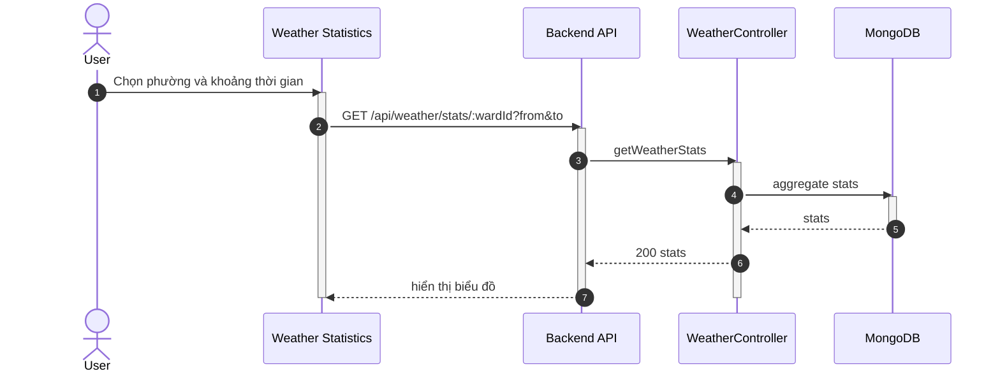

## UC - Xem thống kê thời tiết theo phường

### Mô tả luồng (dạng bảng)

**Bảng 2.74: Đặc tả Sequence Diagram – Xem thống kê thời tiết theo phường**

**Tác nhân/Thành phần**

| Thành phần | Mô tả |
|:-----------|:------|
| Người dùng | Xem thống kê |
| Weather Statistics | Giao diện thống kê |
| WeatherController | Truy vấn thống kê |
| Cơ sở dữ liệu | Lưu trữ thời tiết |

**Điều kiện tiên quyết**

| Điều kiện | Mô tả |
|:----------|:------|
| Dữ liệu | Có dữ liệu thời tiết theo phường |

**Luồng chính**

| Bước | Mô tả |
|:-----|:------|
| 1 | Người dùng truy cập vào trang Weather Statistics và chọn phường cần xem thống kê. |
| 2 | Người dùng chọn khoảng thời gian (từ ngày - đến ngày) để xem thống kê. |
| 3 | Người dùng nhấn nút "Xem thống kê", và giao diện gửi yêu cầu GET `/api/weather/stats/:wardId?from=...&to=...` đến Backend API. |
| 4 | Backend API nhận yêu cầu và chuyển đến WeatherController để xử lý. |
| 5 | WeatherController thực hiện truy vấn cơ sở dữ liệu để tổng hợp dữ liệu thời tiết theo phường và khoảng thời gian đã chọn. |
| 6 | Cơ sở dữ liệu trả về kết quả thống kê (trung bình nhiệt độ, tổng lượng mưa, độ ẩm trung bình, tốc độ gió trung bình, ...). |
| 7 | WeatherController xử lý và tính toán các chỉ số thống kê từ dữ liệu. |
| 8 | WeatherController trả kết quả thống kê về Backend API. |
| 9 | Backend API trả kết quả về giao diện Weather Statistics. |
| 10 | Giao diện hiển thị biểu đồ và bảng thống kê cho người dùng. |

**Luồng sự kiện phụ**

**A1 – Không có dữ liệu**

| Bước | Mô tả |
|:-----|:------|
| A1.1 | WeatherController truy vấn cơ sở dữ liệu nhưng không tìm thấy dữ liệu thời tiết trong khoảng thời gian đã chọn. |
| A1.2 | Cơ sở dữ liệu trả về kết quả rỗng. |
| A1.3 | WeatherController trả về thông báo "Không có dữ liệu" về Backend API. |
| A1.4 | Backend API chuyển thông báo về giao diện. |
| A1.5 | Giao diện hiển thị trạng thái trống hoặc thông báo "Không có dữ liệu" cho người dùng. |
