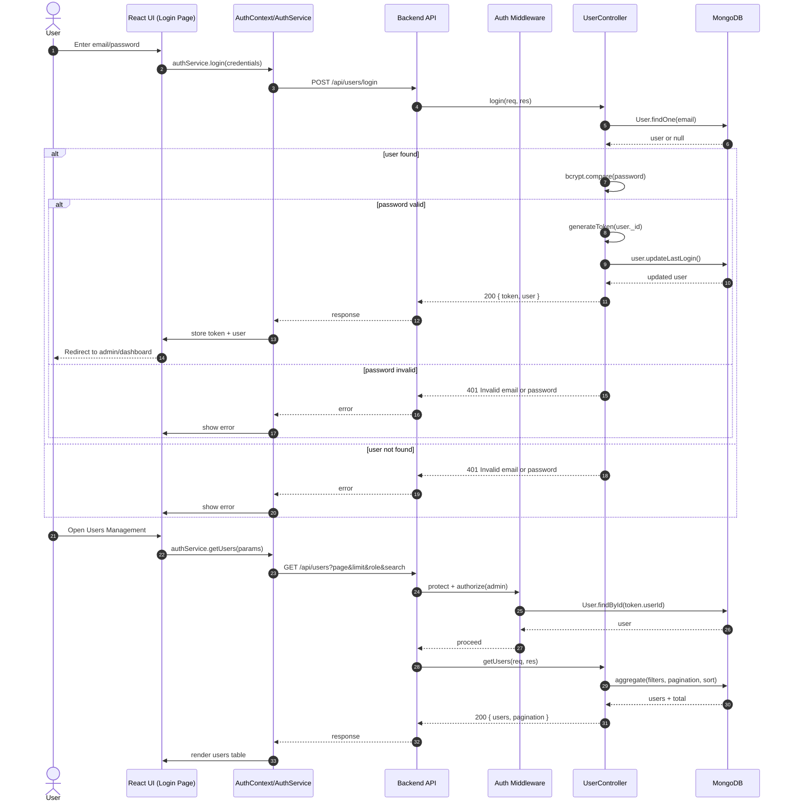

## User Login and Admin Get Users Sequence

```mermaid
sequenceDiagram
autonumber
actor User
participant UI as React UI (Login Page)
participant Auth as AuthContext/AuthService
participant API as Backend API
participant AuthMW as Auth Middleware
participant Users as UserController
participant DB as MongoDB

User->>UI: Enter email/password
UI->>Auth: authService.login(credentials)
Auth->>API: POST /api/users/login
API->>Users: login(req, res)
Users->>DB: User.findOne(email)
DB-->>Users: user or null
alt user found
  Users->>Users: bcrypt.compare(password)
  alt password valid
    Users->>Users: generateToken(user._id)
    Users->>DB: user.updateLastLogin()
    DB-->>Users: updated user
    Users-->>API: 200 { token, user }
    API-->>Auth: response
    Auth->>UI: store token + user
    UI-->>User: Redirect to admin/dashboard
  else password invalid
    Users-->>API: 401 Invalid email or password
    API-->>Auth: error
    Auth->>UI: show error
  end
else user not found
  Users-->>API: 401 Invalid email or password
  API-->>Auth: error
  Auth->>UI: show error
end

User->>UI: Open Users Management
UI->>Auth: authService.getUsers(params)
Auth->>API: GET /api/users?page&limit&role&search
API->>AuthMW: protect + authorize(admin)
AuthMW->>DB: User.findById(token.userId)
DB-->>AuthMW: user
AuthMW-->>API: proceed
API->>Users: getUsers(req, res)
Users->>DB: aggregate(filters, pagination, sort)
DB-->>Users: users + total
Users-->>API: 200 { users, pagination }
API-->>Auth: response
Auth->>UI: render users table
```
